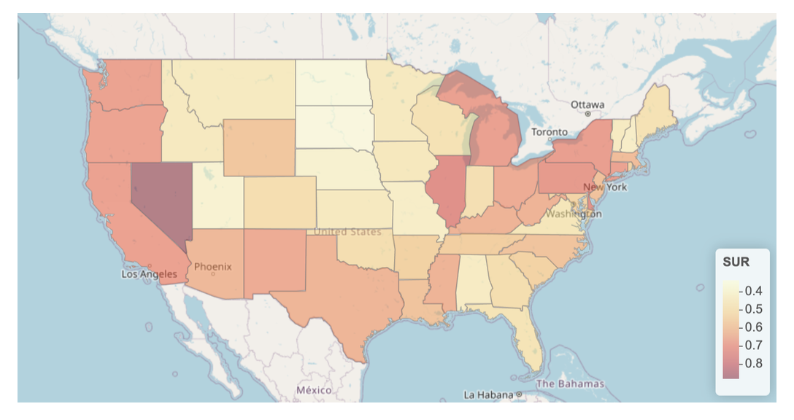
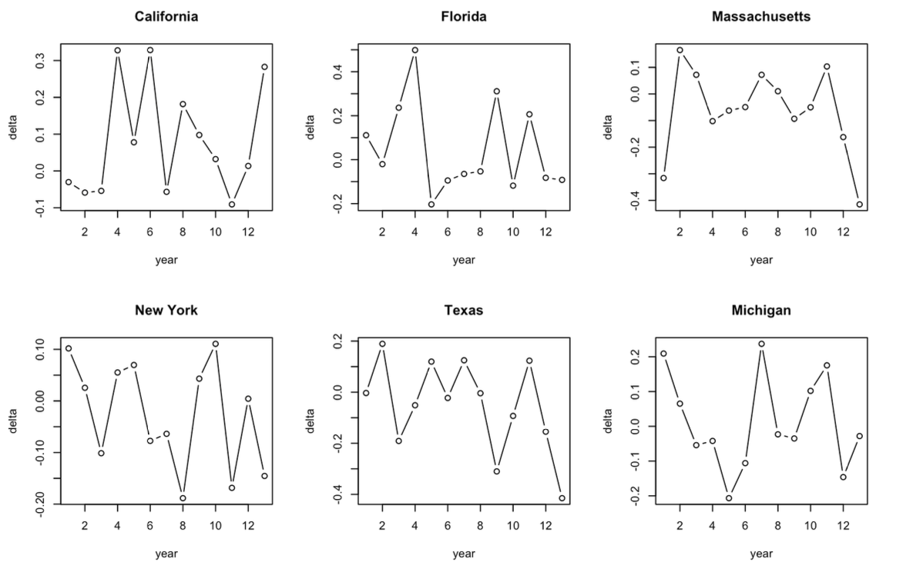
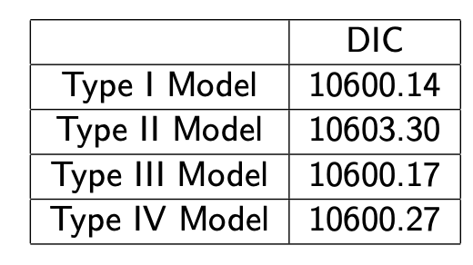

## Bayesian Modeling for Unemployment Trend Overtime in US

### 1. Introduction

### 2.  Data Exploration and Visualization

#### Posterior Estimate of Standardized Unemployment Rate in 2022

### 3. Bayesian Modeling

#### 3.1 Model Specification

Below is the model specification for a bayesian spatial-temporal model without interaction effect (Type I Model). 

$$Y_{it}|\theta_{it} \backsim Poisson(E_{it}\theta_{it})$$

$$log(\theta_{it}) = \beta_0 + \beta_1 X_{GDP} + \beta_2 X_{consumption} + \beta_3 X_{jobs} + v_i + u_i + \gamma_t + \phi_t + \delta_{it}$$

$$\beta_0, \cdots, \beta_3 \backsim N(0, 10000)$$

$$u_i \backsim CAR$$

$$\gamma_t \backsim \text{Random Work Model}$$

$$\nu_i \mathop\backsim \limits^{iid} N(0, \sigma^2_{\nu})$$

$$\phi_t \mathop\backsim \limits^{iid} N(0, \sigma^2_{\phi})$$

$$\delta_{it} \mathop\backsim \limits^{iid} N(0, \sigma^2_{\delta})$$

#### 3.2 Check Space-Time Interaction

Besides, we will fit another three bayesian spatial-temporal model with different levels of interaction effects.

Type II Model: 

Type III Model: 

Type IV Model: 

#### 3.3 Model Comparison

Given that the Type I Model has the lowest DIC, it provides a better fit compared to the other three models.

